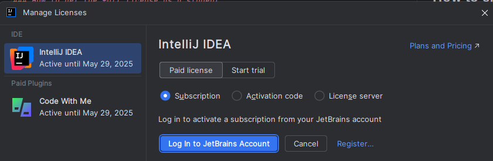
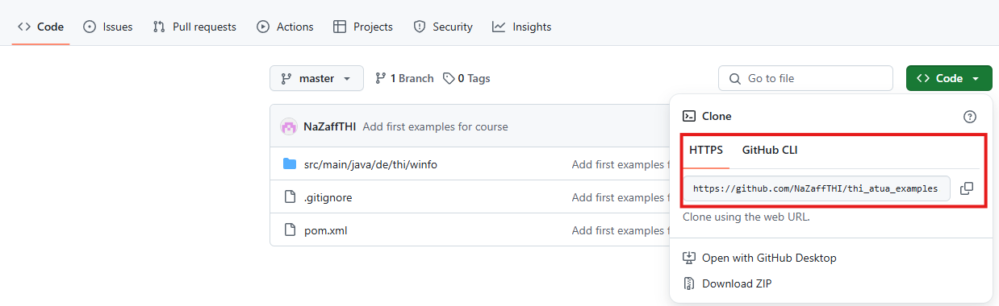
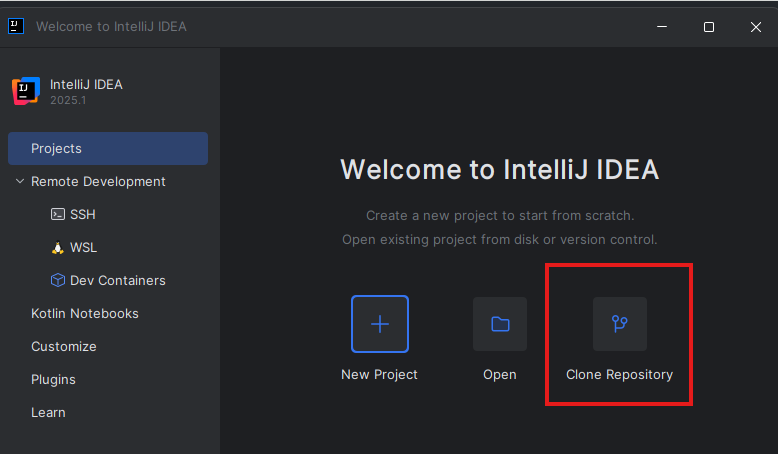
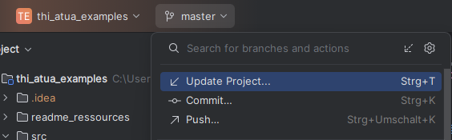

# Example code for AT4UA course

## 1 How to add this project to Intellij IDEA

### 1.1 How to get the full license as a student

1. Get your student license to use IntelliJ without any limitations.  
    Apply at the end of [this site](https://www.jetbrains.com/community/education/#students) and make sure to **use your university mail address**  
    You will receive an email with a link to your free license. Follow that link and login (you may have to create a password to login) 
2. Download IntelliJ [here](https://www.jetbrains.com/idea/download)
2. Install IntelliJ (default config) and allow access if asked. 
3. When first starting IntelliJ, you will be asked for a license. Choose "Paid License", "Subscription" and "Log in to JetBrains Account". 
 After logging in, your license will be linked and you can use IntelliJ for one year, before you have to renew your license.  
 

### 1.2 How to clone this repository and add it to intelliJ

1. On the main page of the repository in GitHub, click on `<> Code` and copy the HTTPS link  
    
2. Open IntelliJ and choose "Clone Repository"  
    
3. Paste the link and confirm

Note: Since you do not contribute (add or alter code) in this project, you don`t need a user or any credentials.  
You can alter the code on your machine to your liking, but you can not upload these changes to the online version.

### 1.3 Run the examples

Open an example, e.g. [AdditionServer](src/main/java/de/thi/winfo/rmi/simple/AdditionServer.java) and hit run on the main method.

### 1.4 How to update
New code examples will be added over time. You can update your project very easily with IntelliJ.
In the upper left corner click on master > Update Project. 
  
If you prefer the terminal, you can use the `git pull` command instead.
More information on git can be found [here](https://git-scm.com/book/en/v2/Getting-Started-What-is-Git%3F) (and you will learn about it in the upcoming semesters)

### 1.4 Troubleshooting

> [!NOTE]  
> If you encounter any problems (and/or solutions for them), you can reach out to me, so I can add them here.

#### Missing SDK
You might get some errors when first opening a class - in the upper right corner you should get the information, that you`re missing a Java SDK. Click on the solution provided (Download SDK) and select the correct version. This Project is build with Java 21.  
You can also check the version by opening the [pom.xml](pom.xml). The number here is the Java version, you need to download this or a higher version.
```xml
<properties>
    <maven.compiler.source>21</maven.compiler.source>
    <maven.compiler.target>21</maven.compiler.target>
    <project.build.sourceEncoding>UTF-8</project.build.sourceEncoding>
</properties>
```

# 2 How to add this project to eclipse

The article on [this site](https://www.geeksforgeeks.org/how-to-clone-a-project-from-github-using-eclipse/) looks promising. I have not tried this, you can share your experiences with me so they can be added here.

# 3 Project structure

## 3.1 Dependencies
This project manages dependencies via [maven](https://maven.apache.org/). You can find all configuration for this projects dependencies in the [pom.xml](pom.xml) on top level of the project. 
Maven is a common way to handle how libraries are added to a Java project. 


## 3.2 Java code
All java code is located under src/main/java/de/thi/winfo. Examples will be linked in the lecture script by classname.